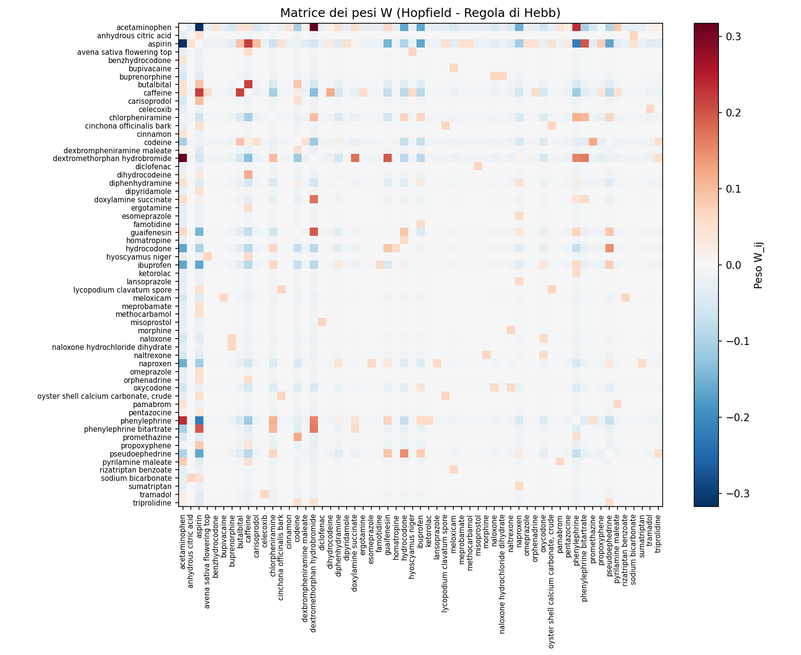
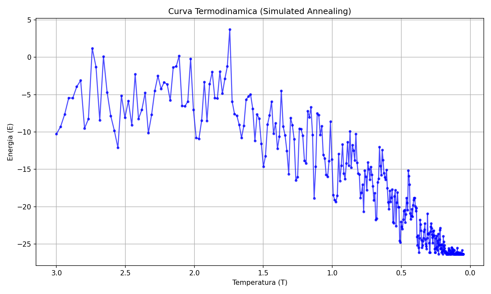

# StoPharma: AI-Driven Polypharmacology con Reti di Hopfield e Termodinamica Statistica

**StoPharma** è un sistema di intelligenza artificiale basato su Reti Neurali di Hopfield e Simulated Annealing, progettato per esplorare lo spazio combinatorio polifarmacologico. A partire da prescrizioni cliniche note, il sistema apprende l'intrinseca topologia relazionale tra principi attivi per "allucinare" nuovi cocktail terapeutici biologicamente ed energeticamente stabili.

---

## Astrazione Matematica del Dominio Farmacologico

Il progetto traduce la polifarmacologia in un problema di meccanica statistica. Lo spazio chimico dei principi attivi è mappato in un vettore di spin (o neuroni di McCulloch-Pitts) $S \in \{-1, +1\}^N$, dove $N$ è il numero totale di molecole in vocabolario. 
I "cocktail" farmacologici presenti nei dataset storici sono impressi come **memorie associative** (minimi energetici globali) in una Rete di Hopfield.

L'Hamiltoniana del sistema (Energia) che descrive la stabilità di una specifica combinazione farmacologica è definita come:

$$ E = -\frac{1}{2} S^T W S + \theta \sum_{i} S_i $$

### Dinamiche di Apprendimento: Hebbian Learning e Covarianza
La matrice delle interazioni sinaptiche $W$ (che rappresenta l'affinità o la repulsione chimico/terapeutica tra due farmaci) viene addestrata mediante la regola di Hebb basata sulla covarianza centrata sulle probabilità di attivazione. Questo accorgimento matematico è cruciale per dataset clinici fortemente sparsi (dove un paziente assume 4 farmaci su un vocabolario di 100), prevenendo il collasso dei pesi su valori negativi che "spegnerebbero" perennemente la rete.


*(Matrice delle interazioni $W$. Le isole rosse indicano forte sinergia terapeutica appresa, quelle blu indicano repulsione o controindicazione).*

### Il Ruolo di $\theta$: Campo Esterno e Matching the Data Statistics
Il parametro $\theta$ introduce un *bias* globale che penalizza l'attivazione dei neuroni, spingendo il sistema verso lo stato di quiete ($S_i = -1$). 
In letteratura fisica, questo approccio equivale a una **Rete di Hopfield con campo esterno uniforme**, ben documentata e studiata (*Amit et al., 1987, "Spin-glass models of neural networks with biased patterns"*).

In StoPharma, abbiamo calibrato il parametro $\theta$ (Fase 2) effettuando uno sweep empirico per trovare il valore esatto che producesse vettori di stato con un numero di nodi attivi (4-8) coincidente con la media dei cocktail originali. Questo non è un mero trucco informatico, ma è la rigorosa applicazione del principio di **"matching the data statistics"**: lo stesso esatto fondamento teorico su cui si basa l'addestramento generativo delle *Restricted Boltzmann Machines* (RBM). Imponiamo, cioè, che l'aspettativa termodinamica della "magnetizzazione" del sistema simulato coincida con la magnetizzazione osservata nel dataset medico reale.

### Esplorazione Entropica: Il Simulated Annealing
Se la rete fosse lasciata evolvere a temperatura $T=0$, collasserebbe deterministicamente in uno dei cocktail già prescritti in passato (memoria perfetta).
Per generare formulazioni polifarmacologiche *nuove*, iniettiamo energia termica (rumore) nel sistema, utilizzando la **Glauber Dynamics** (Simulated Annealing). 

Abbassando gradualmente la temperatura, permettiamo al sistema di saltare fuori dalle valli dei pattern noti e di stabilizzarsi, per raffreddamento, nei **minimi locali spuri** (*spurious states*). Mentre nell'informatica tradizionale gli stati spuri di una rete di Hopfield sono considerati "rumore da evitare", in StoPharma essi rappresentano l'obiettivo primario: le **allucinazioni creative**. Sono combinazioni di farmaci mai viste prima, che tuttavia rispettano profondamente i vincoli chimico-terapeutici latenti codificati in $W$.


*(Discesa termodinamica dell'energia del sistema al calare della temperatura (rumore) durante il Simulated Annealing).*

---

## Validazione Biologica ed Epatica (Triage)

Gli *spurious states* generati matematicamente vengono infine passati attraverso un severo colino biologico e clinico (Fase 4 e Fase 6), per dimostrarne la cantierabilità nel mondo reale:

1. **Esclusività di Target Competitivo (Es. FANS):** Filtri logici che escludono combinazioni tossiche derivanti dalla somministrazione di molecole con target enzimatico identico (es. inibizione COX condivisa tra Ibuprofene e Naprossene).
2. **Interrogazione Database FDA (RxNorm):** Cross-check automatizzato via API per escludere cocktail noti per causare interazioni gravi.
3. **ADMET Computazionale e Legge di Lipinski:** Tramite la libreria RDKit e PubChemPy, il sistema scarica le properties fisiche (SMILES) del cocktail generato e calcola il peso molecolare totale (valutando il carico epatico-renale) e la bio-disponibilità orale (LogP, H-Bonds), scartando le formulazioni non somministrabili.

---

## Struttura e Utilizzo (Pipeline)

### Requisiti
- Python 3.10+
- `numpy`, `pandas`, `matplotlib`, `requests`, `pubchempy`

### Esecuzione Modulare
La pipeline simula l'intero ciclo di scoperta farmacologica:
```bash
python builder.py               # 1. Parsing prescrizioni 
python fase1_validate.py        # 2. QA Dataset
python fase2_hopfield.py        # 3. Hebbian Learning Matrix (W)
python theta_sweep.py           # 4. Matching the data statistics (Calibrazione θ)
python fase3_annealing.py       # 5. Generazione Entropica (Stati Spuri)
python fase4_validation.py      # 6. Triage Interazioni (FANS / RxNorm)
python fase6_biology.py         # 7. Check ADMET (Biodisponibilità)
```

Un output generato con successo apparirà come:
```text
Molecola           | MW (Da)  | LogP   | HBD | HBA | Violazioni Lipinski
----------------------------------------------------------------------------
acetaminophen      | 151.16   | 0.50   | 2   | 2   | 0 [OK]
carisoprodol       | 260.33   | 1.90   | 2   | 4   | 0 [OK]
...

-> Carico metabolico totale (Somma pesi molecolari): 1950.40 Da
   [OK] Il carico molecolare totale e' entro limiti ragionevoli.
   [OK] Ottima biodisponibilita' orale prevista per il cocktail.
```

---
*Disclaimer: StoPharma è un proof-of-concept di biologia computazionale. Le combinazioni farmaceutiche "allucinate" dall'intelligenza artificiale non sostituiscono in alcun modo protocolli clinici (PBPK Modeling, In-Vivo Trials) né il parere medico.*
